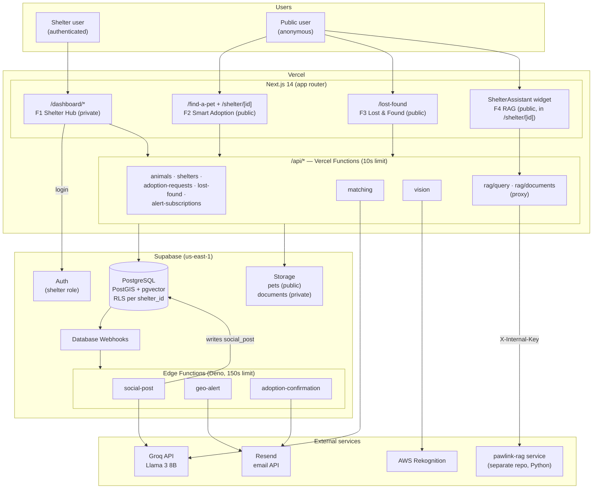
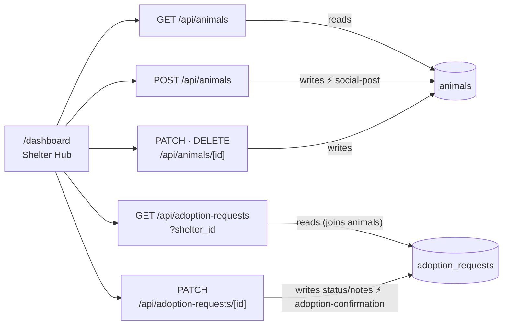
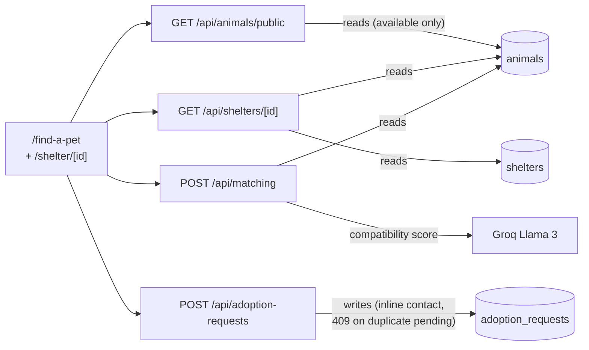
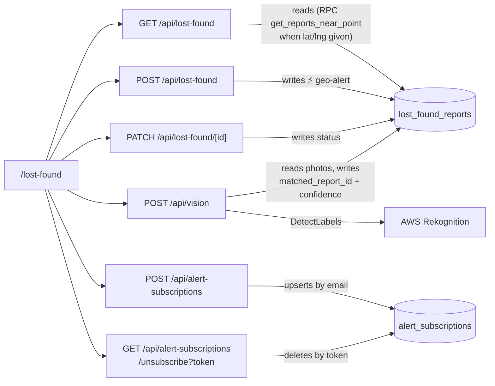
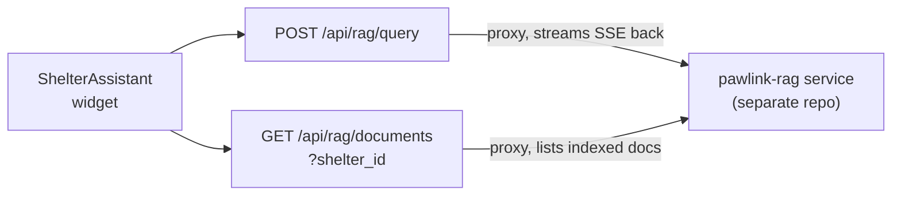
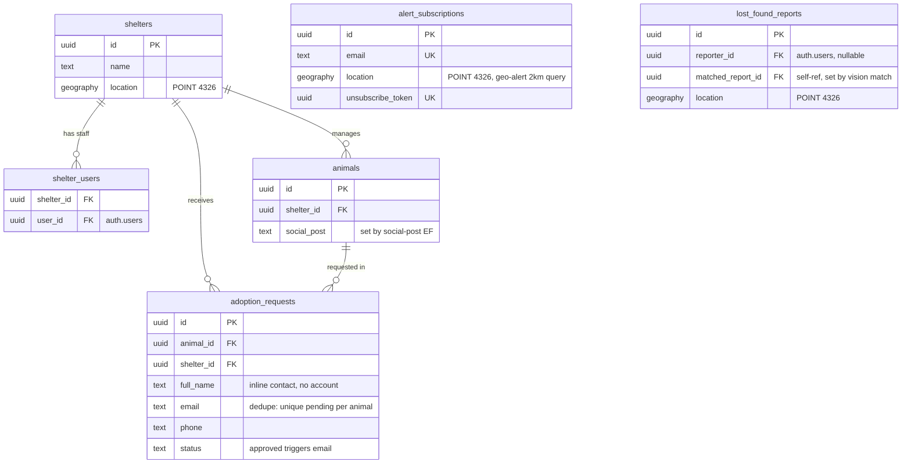
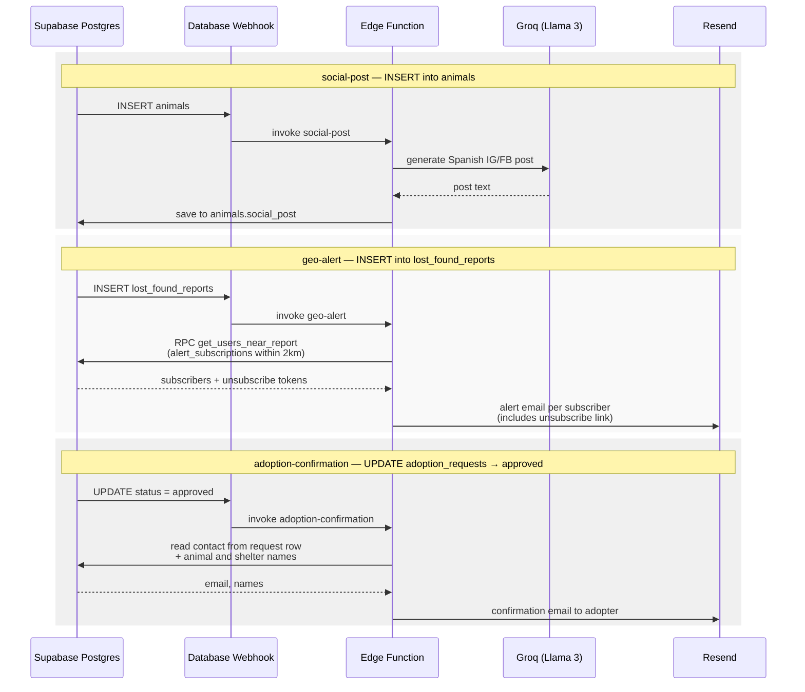

# Pawlink — System Architecture

Visual reference for the system design. Diagrams are written in [Mermaid](https://mermaid.js.org/) and render automatically on GitHub.

Source of truth reminders: database structure lives in [`schema.sql`](./schema.sql), API shapes live in [`api-contracts/`](./api-contracts/). If a diagram ever disagrees with those, the diagrams are the ones that are wrong.

---

## 1. High-level architecture

Everything is serverless: Next.js + `/api/*` functions on Vercel, data and async workflows on Supabase, third-party AI/email services called from functions only (never from the browser).

Key boundaries:

- **F1 `/dashboard/*` is private** — only authenticated shelter users, never linked publicly.
- **Multi-tenant** — every shelter-owned table has `shelter_id`; RLS enforces it at the DB level and every query filters by it anyway (defense in depth).
- **No always-on servers** — long work (>10s) goes to Supabase Edge Functions triggered by Database Webhooks, not to Vercel Functions.
- **No account needed for the public** — adoption requests carry inline contact info (`full_name`, `email`, `phone`) and geo-alerts are an email opt-in (`alert_subscriptions`), so anonymous users never touch Supabase Auth.

---

## 2. Feature → endpoint → table map

Who calls what, and whether it reads or writes. Solid arrows = the feature calls the endpoint; labeled arrows = what the endpoint does to each table. Verified against the route handlers in `app/api/`.

### F1 — Shelter Hub (`/dashboard`, private)

### F2 — Smart Adoption (`/find-a-pet` + `/shelter/[id]`, public)

### F3 — Lost & Found (`/lost-found`, public)

### F4 — RAG Shelter Assistant (chat widget in `/shelter/[id]`, public)

The RAG endpoints are **pure proxies** — they touch no Supabase table in this repo. They exist so the `RAG_INTERNAL_API_KEY` stays server-side; the actual retrieval/generation pipeline lives in the separate `pawlink-rag` service (`RAG_SERVICE_URL`). The F4 tables in `schema.sql` remain commented out — document storage is the service's concern.

⚡ = the write fires a Database Webhook that triggers the Edge Function named next to it (see section 4).

Full reference table:

| Feature | Endpoint | Reads | Writes | External |
|---|---|---|---|---|
| F1 | `GET /api/animals` | `animals` | — | — |
| F1 | `POST /api/animals` | — | `animals` ⚡ social-post | — |
| F1 | `PATCH · DELETE /api/animals/[id]` | — | `animals` | — |
| F1 | `GET /api/adoption-requests?shelter_id` | `adoption_requests` + `animals` | — | — |
| F1 | `PATCH /api/adoption-requests/[id]` | — | `adoption_requests` ⚡ adoption-confirmation (on `approved`) | — |
| F2 | `GET /api/animals/public` | `animals` (available only) | — | — |
| F2 | `GET /api/shelters/[id]` | `shelters`, `animals` | — | — |
| F2 | `POST /api/matching` | `animals` | — | Groq |
| F2 | `POST /api/adoption-requests` | — | `adoption_requests` (inline contact, 409 dedupe) | — |
| F3 | `GET /api/lost-found` | `lost_found_reports` (RPC `get_reports_near_point`) | — | — |
| F3 | `POST /api/lost-found` | — | `lost_found_reports` ⚡ geo-alert | — |
| F3 | `PATCH /api/lost-found/[id]` | — | `lost_found_reports` (status) | — |
| F3 | `POST /api/vision` | `lost_found_reports` (photos) | `lost_found_reports` (match fields, both rows) | AWS Rekognition |
| F3 | `POST /api/alert-subscriptions` | — | `alert_subscriptions` (upsert by email) | — |
| F3 | `GET /api/alert-subscriptions/unsubscribe` | — | `alert_subscriptions` (delete by token) | — |
| F4 | `POST /api/rag/query` | — | — | pawlink-rag (SSE) |
| F4 | `GET /api/rag/documents` | — | — | pawlink-rag |
| debug | `POST /api/lost-found/alert` | `alert_subscriptions` (RPC `get_users_near_report`) | — | — |

`POST /api/lost-found/alert` is a debug-only endpoint kept for manually verifying the PostGIS radius query — it does not send emails (the geo-alert Edge Function owns that).

---

## 3. Data model

Simplified view of `schema.sql` (see the file for full columns, constraints, and RLS policies).

Notes on the current state:

- `adoption_requests` now carries the adopter's contact inline (`full_name`, `email`, `phone`) — no account needed. A partial unique index (`animal_id` + `email` where `status = 'pending'`) backs the 409 dedupe.
- `alert_subscriptions` is a standalone opt-in table (email + map point) with no FKs; only the service role touches it. It replaced `family_profiles` as the source of geo-alert recipients.
- `family_profiles` is **legacy** — already backfilled into `alert_subscriptions` and scheduled for removal in phase 2.
- `lost_found_reports.matched_report_id` is a self-reference to the same table (set by the vision match, linking a *lost* report to its *found* counterpart) — drawn as a column note instead of a relationship line for readability.

---

## 4. Async workflows (Database Webhooks → Edge Functions)

Three workflows fire on database events. Edge Function code lives in `supabase/functions/<name>/index.ts` and must be deployed manually (`supabase functions deploy <name>`) — it does not auto-deploy on push.

