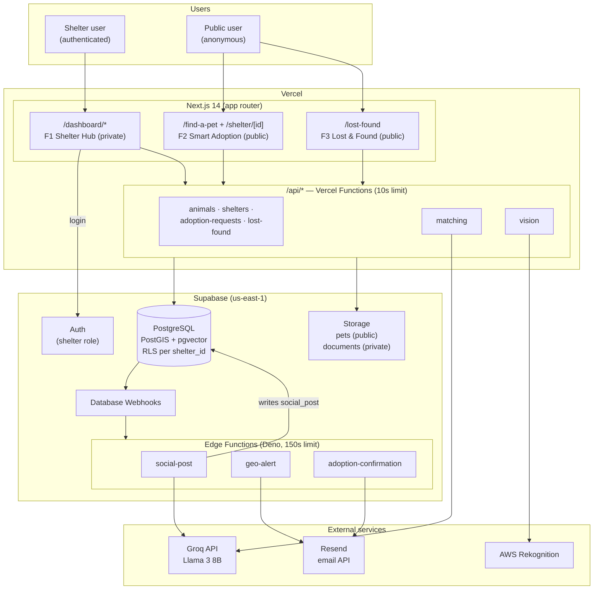
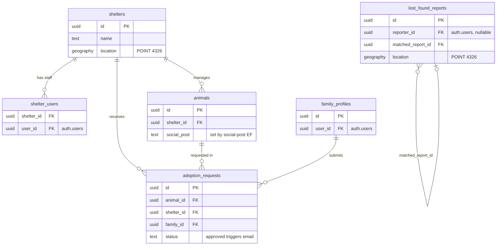
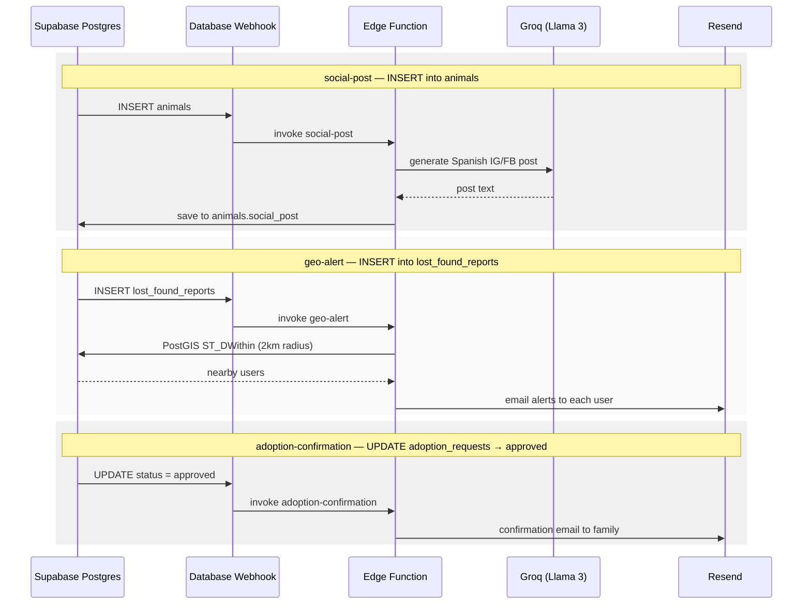

# Pawlink — System Architecture

Visual reference for the system design. Diagrams are written in [Mermaid](https://mermaid.js.org/) and render automatically on GitHub.

Source of truth reminders: database structure lives in [`schema.sql`](./schema.sql), API shapes live in [`api-contracts/`](./api-contracts/). If a diagram ever disagrees with those, the diagrams are the ones that are wrong.

---

## 1. High-level architecture

Everything is serverless: Next.js + `/api/*` functions on Vercel, data and async workflows on Supabase, third-party AI/email services called from functions only (never from the browser).

Key boundaries:

- **F1 `/dashboard/*` is private** — only authenticated shelter users, never linked publicly.
- **Multi-tenant** — every shelter-owned table has `shelter_id`; RLS enforces it at the DB level and every query filters by it anyway (defense in depth).
- **No always-on servers** — long work (>10s) goes to Supabase Edge Functions triggered by Database Webhooks, not to Vercel Functions.

---

## 2. Data model

Simplified view of `schema.sql` (see the file for full columns, constraints, and RLS policies).

---

## 3. Async workflows (Database Webhooks → Edge Functions)

Three workflows fire on database events. Edge Function code lives in `supabase/functions/<name>/index.ts` and must be deployed manually (`supabase functions deploy <name>`) — it does not auto-deploy on push.

