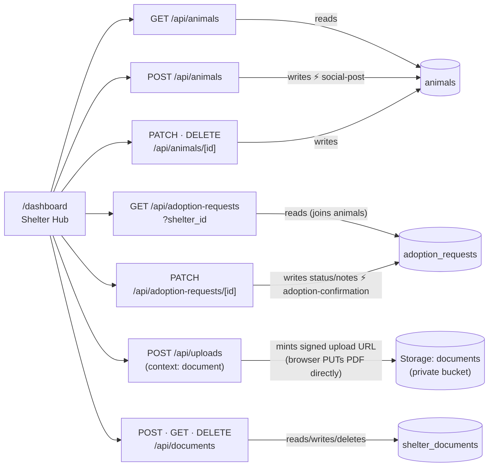
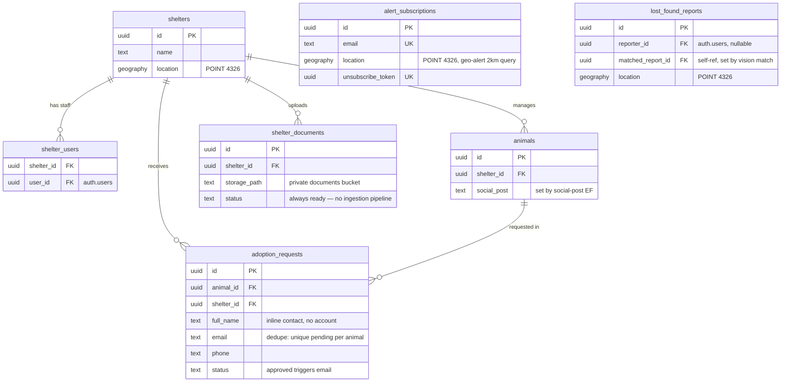

# Real Shelter Document Upload Implementation Plan

> **For agentic workers:** REQUIRED SUB-SKILL: Use superpowers:subagent-driven-development (recommended) or superpowers:executing-plans to implement this plan task-by-task. Steps use checkbox (`- [ ]`) syntax for tracking.

**Goal:** Replace the dashboard's fake "Documents" mock with a real upload — shelters can upload a PDF, see it persisted, and delete it — fully decoupled from the RAG assistant (which keeps reading only from the external pawlink-rag service's two pre-seeded test shelters).

**Architecture:** A signed-upload-URL flow identical in shape to the existing `pets`-bucket flow, pointed at the already-provisioned private `documents` bucket. A new `shelter_documents` table tracks what was uploaded. Three tasks: (1) extend the shared minting endpoint for the new bucket/content-type, (2) add the schema and the register/list/delete routes, (3) rewire the dashboard component off mock data.

**Tech Stack:** Next.js 14 App Router route handlers, Supabase (Postgres + Storage, service-role client), React (dashboard component + hook), `scripts/smoke-test.mjs` (real-infra checks, no mocks).

## Global Constraints

- Spec: `docs/superpowers/specs/2026-07-26-shelter-document-upload-design.md` — read it if anything below is ambiguous.
- The `documents` Storage bucket already exists in production (verified live): private, `file_size_limit: 10485760` (10MB), `allowed_mime_types: ["application/pdf"]`. Do not recreate it.
- **Not wired to RAG.** Uploading a document here must never call, reference, or modify anything under `/api/rag/*` or the pawlink-rag service. The RAG assistant's document list continues to come only from `GET /api/rag/documents`.
- **No session verification** on the new/changed routes — match the existing pattern used by `/api/animals`, `/api/adoption-requests`, `/api/shelters/[id]` (trust the `shelter_id` the caller supplies). This is a deliberate, already-discussed decision — do not add auth checks as a "while I'm here" improvement.
- **No ownership check on delete** — `DELETE /api/documents/:id` deletes by `id` alone, matching `DELETE /api/animals/:id` exactly (see `app/api/animals/[id]/route.ts:34-50`).
- `status` on `shelter_documents` always defaults to `'ready'` and the app never sets any other value — there is no ingestion pipeline, so no processing/error state ever occurs. Do not build a state machine for it.
- Never return raw Supabase `error.message` mixed with static strings inconsistently — follow the exact pattern already used in every route this plan touches (`{ error: error.message }` for 500s from Supabase, static strings for validation 400s).
- Sync docs in the same task as the behavior they describe: `docs/api-contracts/*.md`, `docs/architecture.md`, `public/openapi.yaml`, `docs/pawlink.postman_collection.json`. Each task below says exactly which of these it touches.
- Test against a local dev server (`npm run dev`, default `http://localhost:3000`) using `node scripts/smoke-test.mjs http://localhost:3000` — do not deploy to test.

---

### Task 1: Extend `POST /api/uploads` with a `document` context

**Files:**
- Modify: `app/api/uploads/route.ts` (full rewrite of the maps and validation logic, same file)
- Modify: `docs/api-contracts/f3-lost-found.md` (existing "POST /api/uploads" section, `~line 124-165`)
- Modify: `public/openapi.yaml` (existing `/api/uploads` path, `~line 528-563`)
- Modify: `scripts/smoke-test.mjs` (new function `checkShelterDocumentUpload`, called from `main()`)

**Interfaces:**
- Consumes: nothing from other tasks in this plan.
- Produces: `POST /api/uploads` response shape used by Task 3's frontend adapter — `{ upload_url: string, public_url: string | null, storage_path: string, expires_in: number }`. `storage_path` is a **new field**, returned for every context. For `context: "document"`, `public_url` is always `null` and `storage_path` is `"<shelter_id>/<uuid>.pdf"`.

- [ ] **Step 1: Write the failing smoke check**

Open `scripts/smoke-test.mjs`. Add this new function immediately after `checkPhotoUploads()` (after its closing `}` around line 357):

```js
// ── Shelter document upload: signed URL to the PRIVATE documents bucket ────

const TINY_PDF_TEXT =
  '%PDF-1.1\n1 0 obj<</Type/Catalog/Pages 2 0 R>>endobj\n2 0 obj<</Type/Pages/Kids[3 0 R]/Count 1>>endobj\n3 0 obj<</Type/Page/Parent 2 0 R/MediaBox[0 0 3 3]>>endobj\ntrailer<</Root 1 0 R>>\n%%EOF'

async function checkShelterDocumentUpload(shelterId) {
  console.log('\nDocumentos del shelter (signed URL a bucket privado):')

  const minted = await api('POST', '/api/uploads', {
    content_type: 'application/pdf', context: 'document', shelter_id: shelterId,
  })
  const mintOk =
    minted.status === 201 &&
    Boolean(minted.json?.upload_url) &&
    minted.json?.public_url === null &&
    Boolean(minted.json?.storage_path)
  record(mintOk, "POST /api/uploads con context: 'document' → 201, public_url null, con storage_path", JSON.stringify(minted.json))
  if (!mintOk) return

  const { upload_url, storage_path } = minted.json
  record(storage_path.startsWith(`${shelterId}/`), 'storage_path va dentro de la carpeta del shelter', storage_path)

  const putRes = await fetch(upload_url, {
    method: 'PUT',
    headers: { 'Content-Type': 'application/pdf' },
    body: Buffer.from(TINY_PDF_TEXT, 'utf8'),
  })
  record(putRes.ok, 'PUT del PDF al upload_url → subida directa a Storage (bucket privado)', `status ${putRes.status}`)

  const wrongType = await api('POST', '/api/uploads', {
    content_type: 'image/png', context: 'document', shelter_id: shelterId,
  })
  record(wrongType.status === 400, 'POST context document con content_type de imagen → 400')

  const noShelterId = await api('POST', '/api/uploads', {
    content_type: 'application/pdf', context: 'document',
  })
  record(noShelterId.status === 400, 'POST context document sin shelter_id → 400')

  return { storage_path }
}
```

Then, inside `async function main() { ... }`, find the line `await checkPhotoUploads()` and add immediately after it:

```js
  await checkShelterDocumentUpload(shelterId)
```

- [ ] **Step 2: Run it to confirm it fails**

Run: `npm run dev` (in one terminal), then in another: `node scripts/smoke-test.mjs http://localhost:3000`

Expected: the new checks under "Documentos del shelter" FAIL — `context: 'document'` is not yet a valid context, so the mint request returns 400 with `context must be lost-found or animal`, and `mintOk` is `false` (the function returns early after the first failed `record`).

- [ ] **Step 3: Rewrite `app/api/uploads/route.ts`**

Replace the entire file content with:

```ts
import { NextResponse } from 'next/server'
import { createServerClient } from '@/lib/supabase/server'

const EXTENSION_BY_CONTENT_TYPE: Record<string, string> = {
  'image/jpeg': 'jpg',
  'image/png': 'png',
  'image/webp': 'webp',
  'application/pdf': 'pdf',
}

const ALLOWED_CONTENT_TYPES_BY_CONTEXT: Record<string, string[]> = {
  'lost-found': ['image/jpeg', 'image/png', 'image/webp'],
  animal: ['image/jpeg', 'image/png', 'image/webp'],
  document: ['application/pdf'],
}

const FOLDER_BY_CONTEXT: Record<string, string> = {
  'lost-found': 'lost-found',
  animal: 'animals',
}

const BUCKET_BY_CONTEXT: Record<string, string> = {
  'lost-found': 'pets',
  animal: 'pets',
  document: 'documents',
}

const PUBLIC_BY_CONTEXT: Record<string, boolean> = {
  'lost-found': true,
  animal: true,
  document: false,
}

// Supabase signed upload URLs are valid for 2 hours (fixed by the storage API)
const UPLOAD_URL_TTL_SECONDS = 7200

interface UploadRequestBody {
  file_name?: string
  content_type: string
  context?: string
  shelter_id?: string
}

// POST /api/uploads
// Mints a single-use signed upload URL — the public `pets` bucket for photos
// (context: 'lost-found', default, or 'animal') or the private `documents`
// bucket for shelter PDFs (context: 'document', requires shelter_id). Each
// bucket enforces its own max size and mime types at upload time.
// Contract: docs/api-contracts/f3-lost-found.md
export async function POST(request: Request) {
  const body: Partial<UploadRequestBody> = await request.json().catch(() => ({}))

  const context = body.context ?? 'lost-found'
  if (typeof context !== 'string' || !Object.hasOwn(BUCKET_BY_CONTEXT, context)) {
    return NextResponse.json({ error: 'context must be lost-found, animal or document' }, { status: 400 })
  }

  const contentType = body.content_type
  const allowedContentTypes = ALLOWED_CONTENT_TYPES_BY_CONTEXT[context]
  if (typeof contentType !== 'string' || !allowedContentTypes.includes(contentType)) {
    return NextResponse.json(
      { error: `content_type must be one of: ${allowedContentTypes.join(', ')}` },
      { status: 400 }
    )
  }

  const validationError = validateUploadRequest(body, context)
  if (validationError) {
    return NextResponse.json({ error: validationError }, { status: 400 })
  }

  const extension = EXTENSION_BY_CONTENT_TYPE[contentType]
  // Random server-side path — the user's file_name never reaches storage.
  // The 'document' context is shelter-scoped (a folder per shelter), unlike
  // the flat lost-found/animals folders used by the other two contexts.
  const path =
    context === 'document'
      ? `${body.shelter_id}/${crypto.randomUUID()}.${extension}`
      : `${FOLDER_BY_CONTEXT[context]}/${crypto.randomUUID()}.${extension}`
  const bucketName = BUCKET_BY_CONTEXT[context]
  const storage = createServerClient().storage.from(bucketName)

  const { data, error } = await storage.createSignedUploadUrl(path)

  if (error || !data) {
    return NextResponse.json({ error: 'Could not create upload URL' }, { status: 500 })
  }

  return NextResponse.json(
    {
      upload_url: data.signedUrl,
      public_url: PUBLIC_BY_CONTEXT[context] ? storage.getPublicUrl(path).data.publicUrl : null,
      storage_path: path,
      expires_in: UPLOAD_URL_TTL_SECONDS,
    },
    { status: 201 }
  )
}

function validateUploadRequest(body: Partial<UploadRequestBody>, context: string): string | null {
  if (body.file_name != null && (typeof body.file_name !== 'string' || body.file_name.length > 255)) {
    return 'file_name must be a string of up to 255 chars'
  }
  if (context === 'document' && typeof body.shelter_id !== 'string') {
    return 'shelter_id is required for context: document'
  }
  return null
}
```

- [ ] **Step 4: Run the smoke check again to confirm it passes**

Run: `node scripts/smoke-test.mjs http://localhost:3000`

Expected: all "Documentos del shelter" lines pass, and every pre-existing check still passes (in particular `POST content_type no permitido → 400` and `POST context inválido → 400` under "Subida anónima de fotos", which exercise the default `lost-found` context — confirm these still show ✓, since the validation order changed).

- [ ] **Step 5: Update the contract doc**

In `docs/api-contracts/f3-lost-found.md`, replace the existing "POST /api/uploads" section's request body, validation, response, notes, and error blocks (roughly lines 124-165) with:

```markdown
**Request body:**
```json
{ "file_name": "foto.jpg", "content_type": "image/jpeg", "context": "lost-found" }
```

**Validation:**
- `content_type` required — depends on `context`: `image/jpeg`, `image/png` or `image/webp` for `lost-found`/`animal`; `application/pdf` for `document`
- `context` optional — `lost-found` (default), `animal`, or `document`. Only changes the storage destination.
- `context: "document"` additionally requires `shelter_id` (uuid) in the body — the file is stored in a per-shelter folder in the private `documents` bucket, not the flat folders used by the other contexts.
- `file_name` optional metadata, max 255 chars — never used in the storage path

**Response 201:**
```json
{
  "upload_url": "https://<project>.supabase.co/storage/v1/object/upload/sign/pets/lost-found/<uuid>.jpg?token=...",
  "public_url": "https://<project>.supabase.co/storage/v1/object/public/pets/lost-found/<uuid>.jpg",
  "storage_path": "lost-found/<uuid>.jpg",
  "expires_in": 7200
}
```
`context: "animal"` produces the same shape with `animals/<uuid>.<ext>` in place of `lost-found/<uuid>.<ext>`.

`context: "document"` produces:
```json
{
  "upload_url": "https://<project>.supabase.co/storage/v1/object/upload/sign/documents/<shelter_id>/<uuid>.pdf?token=...",
  "public_url": null,
  "storage_path": "<shelter_id>/<uuid>.pdf",
  "expires_in": 7200
}
```
`public_url` is always `null` for `document` — the `documents` bucket is private. After the `PUT` succeeds, register the document with `POST /api/documents` (see `f1-shelter-hub.md`) so the shelter's dashboard can list it.

**Client flow (per photo/document):**
1. `POST /api/uploads` with the file's `content_type` (and `context`/`shelter_id` if uploading a shelter document)
2. `PUT upload_url` with the raw file bytes and a `Content-Type` header
3. For photos: collect `public_url` and submit it in the calling resource's `photo_urls`. For documents: call `POST /api/documents` with `storage_path` to register it (see `f1-shelter-hub.md`).

**Notes:**
- The bucket enforces max size and allowed mime types at upload time; the token expires in 2 hours and only works for its one path. `pets`: 5MB, images only. `documents`: 10MB, PDF only.
- Photos uploaded but never attached to a submitted resource stay in the bucket (accepted MVP trade-off)
- `/api/vision` already accepts these URLs (its allowlist includes the project's Supabase hostname)

**Error 400:**
```json
{ "error": "content_type must be one of: image/jpeg, image/png, image/webp" }
{ "error": "context must be lost-found, animal or document" }
{ "error": "shelter_id is required for context: document" }
```
```

- [ ] **Step 6: Update `public/openapi.yaml`**

Replace the existing `/api/uploads` path block (lines 528-563) with:

```yaml
  /api/uploads:
    post:
      tags: [Lost & Found (F3)]
      summary: Genera una signed upload URL de un solo uso para subir una foto o un documento
      description: >
        Endpoint sin auth propia (sigue el patrón del resto del MVP) para subir directo a
        Supabase Storage. `context: 'lost-found'` (default) o `'animal'` van al bucket público
        `pets`. `context: 'document'` va al bucket privado `documents` (requiere `shelter_id`) —
        usado por el dashboard de la shelter para subir PDFs. Una request por archivo.
      requestBody:
        required: true
        content:
          application/json:
            schema:
              type: object
              required: [content_type]
              properties:
                content_type: { type: string, enum: [image/jpeg, image/png, image/webp, application/pdf] }
                file_name: { type: string, maxLength: 255, description: Metadata opcional — nunca se usa en el path de storage }
                context: { type: string, enum: [lost-found, animal, document], default: lost-found }
                shelter_id: { type: string, format: uuid, description: Requerido solo cuando context es 'document' }
      responses:
        '201':
          description: >
            Signed upload URL creada (expira en 2h, un solo uso). El browser hace un PUT
            del archivo a upload_url. public_url es null cuando context es 'document'
            (bucket privado) — en ese caso usa storage_path para registrar el documento
            con POST /api/documents.
          content:
            application/json:
              schema:
                type: object
                properties:
                  upload_url: { type: string, format: uri }
                  public_url: { type: string, format: uri, nullable: true }
                  storage_path: { type: string, example: lost-found/9f8e.../abc.jpg }
                  expires_in: { type: integer, example: 7200 }
        '400': { $ref: '#/components/responses/BadRequest' }
        '500': { $ref: '#/components/responses/ServerError' }
```

- [ ] **Step 7: Commit**

```bash
git checkout -b fix/shelter-document-upload
git add app/api/uploads/route.ts docs/api-contracts/f3-lost-found.md public/openapi.yaml scripts/smoke-test.mjs
git commit -m "feat: extend POST /api/uploads with a document context for the private documents bucket"
```

---

### Task 2: `shelter_documents` schema + `/api/documents` routes (register, list, delete)

**Files:**
- Modify: `docs/schema.sql` (uncomment/adapt the `shelter_documents` block, `~line 401-448`)
- Create: `app/api/documents/route.ts` (POST register, GET list)
- Create: `app/api/documents/[id]/route.ts` (DELETE)
- Modify: `docs/api-contracts/f1-shelter-hub.md` (new "Shelter Documents" section)
- Modify: `docs/architecture.md` (F1 diagram, reference table, ER diagram, F4 decoupling note)
- Modify: `public/openapi.yaml` (new `/api/documents` and `/api/documents/{id}` paths + `Document` schema)
- Modify: `docs/pawlink.postman_collection.json` (three new items under "F1 — Shelter Hub")
- Modify: `scripts/smoke-test.mjs` (extend `checkShelterDocumentUpload`)

**Interfaces:**
- Consumes: `checkShelterDocumentUpload`'s mint+PUT steps from Task 1 (same function, extended here) — the `storage_path` that function already produced.
- Produces: `shelter_documents` table (`id`, `shelter_id`, `file_name`, `storage_path`, `status`, `created_at`); `POST /api/documents` → `{ document: { id, file_name, status, created_at } }`; `GET /api/documents?shelter_id=` → `{ documents: [...], total }`; `DELETE /api/documents/:id` → `{ message: string }`. Task 3's frontend adapter consumes all three.

- [ ] **Step 1: Apply the schema migration**

Run this SQL via the `mcp__claude_ai_Supabase__apply_migration` tool (`project_id: "etxjyvjrinsvrnzqwmpf"`, pick a descriptive migration name like `add_shelter_documents`):

```sql
create table shelter_documents (
  id            uuid primary key default gen_random_uuid(),
  shelter_id    uuid references shelters(id) on delete cascade,
  file_name     text not null,
  storage_path  text not null,
  status        text default 'ready',
  created_at    timestamptz default now()
);

create index shelter_documents_shelter_id_idx on shelter_documents(shelter_id);

alter table shelter_documents enable row level security;

create policy "shelter_documents_shelter_all"
  on shelter_documents for all
  using (
    exists (
      select 1 from shelter_users
      where shelter_users.shelter_id = shelter_documents.shelter_id
      and shelter_users.user_id = auth.uid()
    )
  );
```

- [ ] **Step 2: Verify the migration (RED becomes possible)**

Run via `mcp__claude_ai_Supabase__execute_sql` (`project_id: "etxjyvjrinsvrnzqwmpf"`):

```sql
select relrowsecurity from pg_class where relname = 'shelter_documents';
```
Expected: one row, `relrowsecurity: true`.

```sql
select policyname from pg_policies where tablename = 'shelter_documents';
```
Expected: one row, `shelter_documents_shelter_all`.

- [ ] **Step 3: Sync `docs/schema.sql`**

Find the commented block at lines 401-448 (`-- F4 — RAG SHELTER ASSISTANT (STRETCH)` through the last commented `document_chunks` policy). Replace only the `shelter_documents` portion — leave `document_chunks` and its policies commented out exactly as they are (that part is real ingestion, still not built). Replace lines 406-414 and 433, 436-444 (the `shelter_documents` table, its RLS toggle, and its policy) with the real, uncommented version:

```sql
create table shelter_documents (
  id            uuid primary key default gen_random_uuid(),
  shelter_id    uuid references shelters(id) on delete cascade,
  file_name     text not null,
  storage_path  text not null,
  status        text default 'ready',            -- always 'ready' today — no ingestion pipeline sets any other value
  created_at    timestamptz default now()
);

create index shelter_documents_shelter_id_idx on shelter_documents(shelter_id);

alter table shelter_documents enable row level security;

create policy "shelter_documents_shelter_all"
  on shelter_documents for all
  using (
    exists (
      select 1 from shelter_users
      where shelter_users.shelter_id = shelter_documents.shelter_id
      and shelter_users.user_id = auth.uid()
    )
  );
```

The `document_chunks` table and its two commented policies (`document_chunks_shelter...` if present, and `document_chunks_public_read`) stay commented out unchanged — they belong to real ingestion, which this task does not build.

- [ ] **Step 4: Write the failing smoke check extension**

In `scripts/smoke-test.mjs`, `checkShelterDocumentUpload` (added in Task 1) currently ends with `return { storage_path }` after the two negative checks. Replace that final `return` line with:

```js
  const registered = await api('POST', '/api/documents', {
    shelter_id: shelterId, file_name: 'SMOKE-politicas.pdf', storage_path,
  })
  record(registered.status === 201 && Boolean(registered.json?.document?.id), 'POST /api/documents (registro) → 201', JSON.stringify(registered.json))
  const documentId = registered.json?.document?.id
  if (!documentId) return

  try {
    const list = await api('GET', `/api/documents?shelter_id=${shelterId}`)
    const found = list.json?.documents?.find((d) => d.id === documentId)
    record(Boolean(found) && found.file_name === 'SMOKE-politicas.pdf', 'GET /api/documents incluye el documento recien registrado', found?.file_name)
  } finally {
    const deleted = await api('DELETE', `/api/documents/${documentId}`)
    record(deleted.status === 200, 'DELETE /api/documents/[id] → 200')

    const listAfter = await api('GET', `/api/documents?shelter_id=${shelterId}`)
    const stillThere = listAfter.json?.documents?.some((d) => d.id === documentId)
    record(!stillThere, 'el documento ya no aparece tras el delete')

    if (hasServiceAccess) {
      const stillInStorage = await fetch(`${SUPA_URL}/storage/v1/object/documents/${storage_path}`, {
        headers: { apikey: SERVICE_KEY, Authorization: `Bearer ${SERVICE_KEY}` },
      })
      record(stillInStorage.status === 400 || stillInStorage.status === 404, 'el archivo ya no existe en Storage tras el delete', `status ${stillInStorage.status}`)
    } else {
      skip('verificar borrado en Storage', 'sin service role')
    }
  }
}
```

(This replaces the old final line of the function; the function signature and everything above it from Task 1 stays as-is.)

- [ ] **Step 5: Run to confirm it fails**

Run: `node scripts/smoke-test.mjs http://localhost:3000`

Expected: "POST /api/documents (registro) → 201" and everything after it FAILS (404, since neither route exists yet). Everything from Task 1 still passes.

- [ ] **Step 6: Create `app/api/documents/route.ts`**

```ts
import { NextResponse } from 'next/server'
import { createServerClient } from '@/lib/supabase/server'

interface RegisterDocumentBody {
  shelter_id?: string
  file_name?: string
  storage_path?: string
}

// POST /api/documents
// Registers a document row after the client's direct PUT to the signed
// upload URL (POST /api/uploads, context: 'document') has succeeded.
// Contract: docs/api-contracts/f1-shelter-hub.md
export async function POST(request: Request) {
  const body: Partial<RegisterDocumentBody> = await request.json().catch(() => ({}))

  const validationError = validateRegisterBody(body)
  if (validationError) {
    return NextResponse.json({ error: validationError }, { status: 400 })
  }

  const supabase = createServerClient()

  const { data, error } = await supabase
    .from('shelter_documents')
    .insert({
      shelter_id: body.shelter_id,
      file_name: body.file_name,
      storage_path: body.storage_path,
    })
    .select('id, file_name, status, created_at')
    .single()

  if (error) {
    return NextResponse.json({ error: error.message }, { status: 500 })
  }

  return NextResponse.json({ document: data }, { status: 201 })
}

function validateRegisterBody(body: Partial<RegisterDocumentBody>): string | null {
  if (typeof body.shelter_id !== 'string') return 'shelter_id is required'
  if (typeof body.file_name !== 'string' || body.file_name.length === 0 || body.file_name.length > 255) {
    return 'file_name is required, up to 255 chars'
  }
  if (typeof body.storage_path !== 'string' || body.storage_path.length === 0) {
    return 'storage_path is required'
  }
  return null
}

// GET /api/documents?shelter_id=
// Lists a shelter's uploaded documents, newest first.
// Contract: docs/api-contracts/f1-shelter-hub.md
export async function GET(request: Request) {
  const { searchParams } = new URL(request.url)
  const shelterId = searchParams.get('shelter_id')

  if (!shelterId) {
    return NextResponse.json({ error: 'shelter_id is required' }, { status: 400 })
  }

  const supabase = createServerClient()

  const { data, error, count } = await supabase
    .from('shelter_documents')
    .select('id, file_name, status, created_at', { count: 'exact' })
    .eq('shelter_id', shelterId)
    .order('created_at', { ascending: false })

  if (error) {
    return NextResponse.json({ error: error.message }, { status: 500 })
  }

  return NextResponse.json({ documents: data ?? [], total: count ?? data?.length ?? 0 }, { status: 200 })
}
```

- [ ] **Step 7: Create `app/api/documents/[id]/route.ts`**

```ts
import { NextResponse } from 'next/server'
import { createServerClient } from '@/lib/supabase/server'

// DELETE /api/documents/:id
// Best-effort Storage cleanup, then deletes the row. No shelter_id ownership
// check — matches the existing DELETE /api/animals/:id convention.
// Contract: docs/api-contracts/f1-shelter-hub.md
export async function DELETE(
  request: Request,
  { params }: { params: { id: string } }
) {
  const supabase = createServerClient()

  const { data: existing } = await supabase
    .from('shelter_documents')
    .select('storage_path')
    .eq('id', params.id)
    .single()

  if (existing?.storage_path) {
    await supabase.storage.from('documents').remove([existing.storage_path])
  }

  const { error } = await supabase
    .from('shelter_documents')
    .delete()
    .eq('id', params.id)

  if (error) {
    return NextResponse.json({ error: error.message }, { status: 500 })
  }

  return NextResponse.json({ message: 'Document deleted' }, { status: 200 })
}
```

- [ ] **Step 8: Run the smoke check again to confirm it passes**

Run: `node scripts/smoke-test.mjs http://localhost:3000`

Expected: every "Documentos del shelter" line passes, including the delete/cleanup lines, and the whole suite's final count increases with no failures.

- [ ] **Step 9: Add the contract section to `docs/api-contracts/f1-shelter-hub.md`**

Insert a new section right before the final `---` and `## Shelter Profile` heading (after the "PATCH /api/adoption-requests/:id" section, around line 173):

```markdown
## Shelter Documents

Not connected to the RAG assistant — these are stored in this repo's own database and Storage, separately from the pawlink-rag service the chat widget reads from.

### POST /api/documents
Registers a document after the client's direct upload succeeds — see `f3-lost-found.md` § Photo Uploads, `context: "document"`, for the signed-URL step that must happen first.

**Request body:**
```json
{ "shelter_id": "uuid", "file_name": "politicas_adopcion.pdf", "storage_path": "uuid/uuid.pdf" }
```

**Response 201:**
```json
{ "document": { "id": "uuid", "file_name": "politicas_adopcion.pdf", "status": "ready", "created_at": "2025-06-09T00:00:00Z" } }
```

**Error 400:** `{ "error": "shelter_id is required" }`, `{ "error": "file_name is required, up to 255 chars" }`, `{ "error": "storage_path is required" }`

---

### GET /api/documents
Lists a shelter's uploaded documents, newest first.

**Query params:** `shelter_id` (uuid, required)

**Response 200:**
```json
{
  "documents": [
    { "id": "uuid", "file_name": "politicas_adopcion.pdf", "status": "ready", "created_at": "2025-06-09T00:00:00Z" }
  ],
  "total": 1
}
```

---

### DELETE /api/documents/:id
Deletes a document — removes the Storage object (best-effort) and the row.

**Response 200:** `{ "message": "Document deleted" }`

---
```

- [ ] **Step 10: Update `docs/architecture.md`**

In the F1 diagram (lines 98-116), add the new nodes and edges. Replace the block with:



Update the note directly under the F4 diagram (currently line 186, the "The RAG endpoints are pure proxies..." paragraph) by appending a sentence:

```markdown
The RAG endpoints are **pure proxies** — they touch no Supabase table in this repo. They exist so the `RAG_INTERNAL_API_KEY` stays server-side; the actual retrieval/generation pipeline lives in the separate `pawlink-rag` service (`RAG_SERVICE_URL`). The F4 tables in `schema.sql` remain commented out — document storage for the RAG assistant is the service's concern. `shelter_documents` (F1, see above) is a separate, unrelated table for the dashboard's own document library — uploading there does not feed the RAG assistant.
```

In the reference table (lines 192-213), add three rows after the `F1 | PATCH /api/adoption-requests/[id]` row:

```markdown
| F1 | `POST /api/uploads` (context: document) | — | Storage `documents` bucket, `<shelter_id>/` (signed upload URL, no DB write) | — |
| F1 | `POST /api/documents` | — | `shelter_documents` | — |
| F1 | `GET /api/documents?shelter_id` | `shelter_documents` | — | — |
| F1 | `DELETE /api/documents/[id]` | — | `shelter_documents`, Storage `documents` bucket | — |
```

In the ER diagram (lines 228-270), add the new entity and relationship:



- [ ] **Step 11: Add the new paths to `public/openapi.yaml`**

Add after the `/api/uploads` path block (which Task 1 already updated) and before `/api/vision`:

```yaml
  /api/documents:
    post:
      tags: [Animals (F1)]
      summary: Registra un documento del shelter tras subirlo a Storage
      description: >
        Segundo paso del flujo de subida (ver POST /api/uploads, context: 'document').
        No conectado al RAG assistant — este documento no alimenta el chatbot.
      requestBody:
        required: true
        content:
          application/json:
            schema:
              type: object
              required: [shelter_id, file_name, storage_path]
              properties:
                shelter_id: { type: string, format: uuid }
                file_name: { type: string, maxLength: 255 }
                storage_path: { type: string, example: 9f8e.../abc.pdf }
      responses:
        '201':
          description: Documento registrado
          content:
            application/json:
              schema:
                type: object
                properties:
                  document: { $ref: '#/components/schemas/Document' }
        '400': { $ref: '#/components/responses/BadRequest' }
        '500': { $ref: '#/components/responses/ServerError' }
    get:
      tags: [Animals (F1)]
      summary: Lista los documentos subidos por un shelter
      parameters:
        - { name: shelter_id, in: query, required: true, schema: { type: string, format: uuid } }
      responses:
        '200':
          description: Lista de documentos (orden created_at desc)
          content:
            application/json:
              schema:
                type: object
                properties:
                  documents:
                    type: array
                    items: { $ref: '#/components/schemas/Document' }
                  total: { type: integer }
        '400': { $ref: '#/components/responses/BadRequest' }
        '500': { $ref: '#/components/responses/ServerError' }

  /api/documents/{id}:
    delete:
      tags: [Animals (F1)]
      summary: Elimina un documento (Storage + fila)
      parameters:
        - { name: id, in: path, required: true, schema: { type: string, format: uuid } }
      responses:
        '200':
          description: Documento eliminado
          content:
            application/json:
              schema:
                type: object
                properties:
                  message: { type: string, example: Document deleted }
        '500': { $ref: '#/components/responses/ServerError' }
```

Add the `Document` schema next to the other schemas in `components.schemas` (after the `Error` schema, ~line 620):

```yaml
    Document:
      type: object
      properties:
        id: { type: string, format: uuid }
        file_name: { type: string, example: politicas_adopcion.pdf }
        status: { type: string, example: ready }
        created_at: { type: string, format: date-time }
```

- [ ] **Step 12: Add the new items to `docs/pawlink.postman_collection.json`**

Inside the `"F1 — Shelter Hub"` folder's `"item"` array, after the `"GET /api/shelters/:id"` item (which currently closes the array at line 96), add three more items before the closing `]`:

```json
        ,
        {
          "name": "POST /api/documents",
          "request": {
            "method": "POST",
            "header": [{ "key": "Content-Type", "value": "application/json" }],
            "url": { "raw": "{{base_url}}/api/documents", "host": ["{{base_url}}"], "path": ["api", "documents"] },
            "body": {
              "mode": "raw",
              "raw": "{\n  \"shelter_id\": \"{{shelter_id}}\",\n  \"file_name\": \"politicas_adopcion.pdf\",\n  \"storage_path\": \"REPLACE_WITH_STORAGE_PATH\"\n}"
            }
          }
        },
        {
          "name": "GET /api/documents",
          "request": {
            "method": "GET",
            "url": {
              "raw": "{{base_url}}/api/documents?shelter_id={{shelter_id}}",
              "host": ["{{base_url}}"],
              "path": ["api", "documents"],
              "query": [{ "key": "shelter_id", "value": "{{shelter_id}}" }]
            }
          }
        },
        {
          "name": "DELETE /api/documents/:id",
          "request": {
            "method": "DELETE",
            "url": { "raw": "{{base_url}}/api/documents/REPLACE_WITH_DOCUMENT_ID", "host": ["{{base_url}}"], "path": ["api", "documents", "REPLACE_WITH_DOCUMENT_ID"] }
          }
        }
```

(That is: change the existing `"GET /api/shelters/:id"` item's closing `}` — currently followed directly by `]` — so it is followed by `,` and then the three new items, before the array's closing `]`.)

- [ ] **Step 13: Validate the docs are syntactically correct**

Run:
```bash
node -e "require('js-yaml').load(require('fs').readFileSync('public/openapi.yaml', 'utf8')); console.log('openapi.yaml OK')"
node -e "JSON.parse(require('fs').readFileSync('docs/pawlink.postman_collection.json', 'utf8')); console.log('postman OK')"
```
Expected: both print `OK` with no errors.

- [ ] **Step 14: Commit**

```bash
git add docs/schema.sql app/api/documents scripts/smoke-test.mjs docs/api-contracts/f1-shelter-hub.md docs/architecture.md public/openapi.yaml docs/pawlink.postman_collection.json
git commit -m "feat: add shelter_documents table and /api/documents routes (register, list, delete)"
```

---

### Task 3: Rewire `DocumentsManager.tsx` off mock data

**Files:**
- Create: `components/shelter/document-adapter.ts`
- Create: `components/shelter/hooks/useShelterDocuments.ts`
- Modify: `components/shelter/DocumentsManager.tsx` (full rewrite)
- Modify: `lib/mock-data.ts` (remove `ShelterDocument` type and `shelterDocuments` array — check first that nothing else imports them)

**Interfaces:**
- Consumes: `POST /api/uploads` (context: `document`) and `POST`/`GET`/`DELETE /api/documents` from Tasks 1-2 — exact shapes as documented in those tasks' Interfaces sections.
- Produces: nothing consumed by other tasks — this is the last task in the plan.

- [ ] **Step 1: Check nothing else uses the mock document data**

Run: `grep -rn "ShelterDocument\|shelterDocuments" --include="*.ts" --include="*.tsx" components/ app/ lib/`

Expected: only matches inside `lib/mock-data.ts` (the definitions) and `components/shelter/DocumentsManager.tsx` (about to be rewritten). If anything else matches, stop and note it — do not delete the mock data out from under another consumer.

- [ ] **Step 2: Create `components/shelter/document-adapter.ts`**

```ts
export type UploadedDocument = {
  id: string
  file_name: string
  status: string
  created_at: string
}

export type DocumentUploadResult =
  | { ok: true; document: UploadedDocument }
  | { ok: false; error: string }

function isObject(value: unknown): value is Record<string, unknown> {
  return typeof value === 'object' && value !== null
}

async function readJsonBody(response: Response): Promise<unknown> {
  try {
    return await response.json()
  } catch {
    return null
  }
}

function getApiErrorMessage(payload: unknown, fallback: string) {
  if (!isObject(payload)) return fallback
  const apiError = payload as { error?: string; message?: string }
  return apiError.error || apiError.message || fallback
}

type UploadUrlResponse = {
  upload_url: string
  storage_path: string
}

function isUploadUrlResponse(value: unknown): value is UploadUrlResponse {
  return isObject(value) && typeof value.upload_url === 'string' && typeof value.storage_path === 'string'
}

async function requestUploadUrl(shelterId: string, file: File): Promise<UploadUrlResponse> {
  const response = await fetch('/api/uploads', {
    method: 'POST',
    headers: { 'Content-Type': 'application/json' },
    body: JSON.stringify({ content_type: file.type, context: 'document', shelter_id: shelterId }),
  })
  const body = await readJsonBody(response)

  if (!response.ok || !isUploadUrlResponse(body)) {
    throw new Error(getApiErrorMessage(body, `Could not prepare "${file.name}" for upload.`))
  }
  return body
}

async function putFile(uploadUrl: string, file: File): Promise<void> {
  const response = await fetch(uploadUrl, {
    method: 'PUT',
    headers: { 'Content-Type': file.type },
    body: file,
  })
  if (!response.ok) {
    throw new Error(`Could not upload "${file.name}". Please try again.`)
  }
}

function isUploadedDocument(value: unknown): value is UploadedDocument {
  return isObject(value) && typeof value.id === 'string' && typeof value.file_name === 'string'
}

async function registerDocument(shelterId: string, file: File, storagePath: string): Promise<UploadedDocument> {
  const response = await fetch('/api/documents', {
    method: 'POST',
    headers: { 'Content-Type': 'application/json' },
    body: JSON.stringify({ shelter_id: shelterId, file_name: file.name, storage_path: storagePath }),
  })
  const body = await readJsonBody(response)
  const document = isObject(body) ? body.document : null

  if (!response.ok || !isUploadedDocument(document)) {
    throw new Error(getApiErrorMessage(body, `Could not save "${file.name}".`))
  }
  return document
}

// Uploads one PDF directly to Supabase Storage via a signed URL
// (POST /api/uploads, context: 'document'), then registers it in
// shelter_documents (POST /api/documents) so the dashboard can list it.
// Not connected to the RAG assistant.
export async function uploadShelterDocument(shelterId: string, file: File): Promise<DocumentUploadResult> {
  try {
    const { upload_url, storage_path } = await requestUploadUrl(shelterId, file)
    await putFile(upload_url, file)
    const document = await registerDocument(shelterId, file, storage_path)
    return { ok: true, document }
  } catch (error) {
    return {
      ok: false,
      error: error instanceof Error ? error.message : 'Could not upload document. Please try again.',
    }
  }
}

export async function fetchShelterDocuments(shelterId: string): Promise<UploadedDocument[]> {
  const response = await fetch(`/api/documents?shelter_id=${encodeURIComponent(shelterId)}`, { cache: 'no-store' })
  if (!response.ok) {
    throw new Error(getApiErrorMessage(await readJsonBody(response), 'Could not load documents'))
  }
  const body = (await response.json()) as { documents?: UploadedDocument[] }
  return body.documents ?? []
}

export async function deleteShelterDocument(documentId: string): Promise<void> {
  const response = await fetch(`/api/documents/${documentId}`, { method: 'DELETE' })
  if (!response.ok) {
    throw new Error(getApiErrorMessage(await readJsonBody(response), 'Could not delete document'))
  }
}
```

- [ ] **Step 3: Create `components/shelter/hooks/useShelterDocuments.ts`**

```ts
'use client'

import { useCallback, useEffect, useRef, useState } from 'react'
import {
  deleteShelterDocument,
  fetchShelterDocuments,
  uploadShelterDocument,
  type UploadedDocument,
} from '@/components/shelter/document-adapter'

export function useShelterDocuments(shelterId: string) {
  const [documents, setDocuments] = useState<UploadedDocument[]>([])
  const [isLoading, setIsLoading] = useState(true)
  const [error, setError] = useState<string | null>(null)
  const [isUploading, setIsUploading] = useState(false)
  const [uploadError, setUploadError] = useState<string | null>(null)
  const [pendingDeleteIds, setPendingDeleteIds] = useState<Set<string>>(new Set())
  const requestIdRef = useRef(0)

  const refetch = useCallback(async () => {
    const requestId = requestIdRef.current + 1
    requestIdRef.current = requestId
    setIsLoading(true)
    setError(null)

    try {
      const result = await fetchShelterDocuments(shelterId)
      if (requestIdRef.current !== requestId) return
      setDocuments(result)
    } catch (fetchError) {
      if (requestIdRef.current !== requestId) return
      setError(fetchError instanceof Error ? fetchError.message : 'Could not load documents')
    } finally {
      if (requestIdRef.current === requestId) setIsLoading(false)
    }
  }, [shelterId])

  useEffect(() => {
    refetch()
  }, [refetch])

  const uploadDocument = useCallback(
    async (file: File) => {
      setUploadError(null)
      setIsUploading(true)
      const result = await uploadShelterDocument(shelterId, file)
      setIsUploading(false)

      if (!result.ok) {
        setUploadError(result.error)
        return false
      }
      setDocuments((current) => [result.document, ...current])
      return true
    },
    [shelterId],
  )

  const setDeletePending = useCallback((documentId: string, pending: boolean) => {
    setPendingDeleteIds((current) => {
      const next = new Set(current)
      if (pending) next.add(documentId)
      else next.delete(documentId)
      return next
    })
  }, [])

  const removeDocument = useCallback(
    async (documentId: string) => {
      const previousDocuments = documents
      setDeletePending(documentId, true)
      setDocuments((current) => current.filter((document) => document.id !== documentId))

      try {
        await deleteShelterDocument(documentId)
        return true
      } catch (deleteError) {
        setDocuments(previousDocuments)
        setUploadError(deleteError instanceof Error ? deleteError.message : 'Could not delete document')
        return false
      } finally {
        setDeletePending(documentId, false)
      }
    },
    [documents, setDeletePending],
  )

  return {
    documents,
    isLoading,
    error,
    isUploading,
    uploadError,
    pendingDeleteIds,
    uploadDocument,
    removeDocument,
  }
}
```

- [ ] **Step 4: Rewrite `components/shelter/DocumentsManager.tsx`**

Replace the entire file content with:

```tsx
'use client'

import { useRef, type ChangeEvent } from 'react'
import { Button } from '@/components/shared/Button'
import { DashboardCard } from '@/components/shared/DashboardCard'
import { EmptyState } from '@/components/shared/EmptyState'
import { SectionTitle } from '@/components/shared/SectionTitle'
import { StatusBadge } from '@/components/shared/StatusBadge'
import { ShelterHubLayout } from '@/components/shelter/ShelterHubLayout'
import { useShelterWorkspace } from '@/components/shelter/ShelterWorkspaceContext'
import { useShelterDocuments } from '@/components/shelter/hooks/useShelterDocuments'

export function DocumentsManager() {
  const { shelterId } = useShelterWorkspace()
  const {
    documents,
    isLoading,
    error,
    isUploading,
    uploadError,
    pendingDeleteIds,
    uploadDocument,
    removeDocument,
  } = useShelterDocuments(shelterId)
  const fileInputRef = useRef<HTMLInputElement>(null)

  function openFilePicker() {
    fileInputRef.current?.click()
  }

  async function handleFileSelected(event: ChangeEvent<HTMLInputElement>) {
    const file = event.target.files?.[0]
    event.target.value = ''
    if (!file) return
    await uploadDocument(file)
  }

  return (
    <ShelterHubLayout
      active="Documents"
      title="Shelter documents"
      subtitle="Upload adoption policies and care information for your team."
      action={<StatusBadge label={`${documents.length} files`} tone="purple" />}
    >
      <div className="grid gap-4 lg:grid-cols-[1fr_340px]">
        <section>
          <DashboardCard>
            <SectionTitle
              title="Document library"
              description="PDFs you upload here are stored securely and only visible to your shelter."
            />
          </DashboardCard>

          {error ? (
            <div className="mt-4">
              <EmptyState title="Could not load documents" description={error} />
            </div>
          ) : null}

          <div className="mt-4 grid gap-3">
            {documents.map((document) => (
              <DashboardCard key={document.id} interactive>
                <div className="flex items-start gap-3">
                  <div className="grid h-12 w-12 place-items-center rounded-2xl bg-violet-100 text-xs font-black text-violet-700">
                    PDF
                  </div>
                  <div className="min-w-0 flex-1">
                    <div className="flex items-start justify-between gap-3">
                      <div className="min-w-0">
                        <p className="truncate text-sm font-black text-slate-950">{document.file_name}</p>
                        <p className="mt-1 text-xs font-semibold text-slate-500">
                          {new Date(document.created_at).toLocaleDateString()}
                        </p>
                      </div>
                      <div className="flex shrink-0 items-center gap-2">
                        <StatusBadge label={document.status} tone="green" />
                        <Button
                          variant="danger"
                          size="sm"
                          onClick={() => removeDocument(document.id)}
                          disabled={pendingDeleteIds.has(document.id)}
                        >
                          Delete
                        </Button>
                      </div>
                    </div>
                  </div>
                </div>
              </DashboardCard>
            ))}
          </div>

          {!isLoading && documents.length === 0 ? (
            <div className="mt-4">
              <EmptyState title="No documents uploaded" description="Upload adoption policies to keep your team aligned." />
            </div>
          ) : null}
        </section>

        <aside className="lg:sticky lg:top-4 lg:self-start">
          <DashboardCard className="border-violet-200 bg-gradient-to-br from-violet-50 to-white">
            <SectionTitle title="Upload PDF" description="PDF files only, up to 10MB." />

            <input
              ref={fileInputRef}
              type="file"
              accept="application/pdf"
              className="hidden"
              onChange={handleFileSelected}
            />

            <button
              onClick={openFilePicker}
              disabled={isUploading}
              className="mt-5 w-full rounded-2xl border border-dashed border-violet-300 bg-white p-6 text-center shadow-sm transition hover:-translate-y-0.5 hover:shadow-lg disabled:opacity-60"
            >
              <div className="mx-auto grid h-14 w-14 place-items-center rounded-2xl bg-violet-600 text-sm font-black text-white">
                +
              </div>
              <p className="mt-3 text-sm font-black text-slate-950">
                {isUploading ? 'Uploading...' : 'Choose document'}
              </p>
              <p className="mt-1 text-xs leading-5 text-slate-500">PDF up to 10MB</p>
            </button>

            {uploadError ? (
              <div className="mt-4 rounded-2xl border border-rose-200 bg-rose-50 p-3 text-xs font-semibold text-rose-700">
                {uploadError}
              </div>
            ) : null}
          </DashboardCard>
        </aside>
      </div>
    </ShelterHubLayout>
  )
}
```

- [ ] **Step 5: Remove the now-unused mock data**

In `lib/mock-data.ts`, delete the `ShelterDocument` type export and the `shelterDocuments` array (confirmed unused elsewhere in Step 1).

- [ ] **Step 6: Type-check**

Run: `npx tsc --noEmit`

Expected: no errors. (This repo has no configured `next lint` — do not run it, it hangs on an interactive scaffold prompt.)

- [ ] **Step 7: Real browser verification**

Using `scripts/provision_shelter.py` (already built in an earlier session), provision a throwaway shelter + admin login, then in a real browser:
1. Log in, navigate to `/dashboard/documents`.
2. Confirm the page loads with an empty list (no mock rows).
3. Click "Choose document", pick a real small PDF, confirm it appears in the list after upload completes.
4. Click "Delete" on it, confirm it disappears from the list.
5. Clean up: delete the shelter, `shelter_users` link, and auth user created for this check (same teardown pattern used for the social-post UI verification in the previous plan).

- [ ] **Step 8: Commit**

```bash
git add components/shelter/document-adapter.ts components/shelter/hooks/useShelterDocuments.ts components/shelter/DocumentsManager.tsx lib/mock-data.ts
git commit -m "feat: rewire DocumentsManager off mock data onto real upload/list/delete"
```
